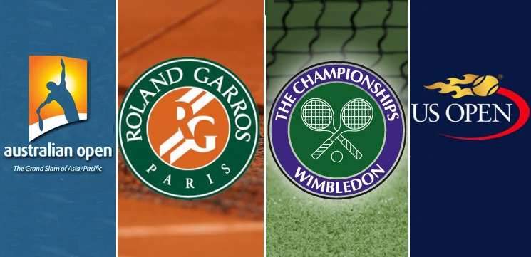

# Tennis Myth Buster - Grand Slam Analysis

## Alejandro & Chun
## Data Analytics Barcelona Feb to Apr 2019

### Overview

The project aims to shine a light on the conventional beliefs which determine the result of tennis matches. Here an analysis is performed based on the data of the Grand Slam tournaments, namely Australian Open, Roland Garros, US Open and Wimbledon.

At the end of the main analysis, an attempt is made to build a classification model to predict the results of Roland Garros with the result of Monte Carlo Masters, since both tournament is similar in nature and intensity, e.g. clay tournaments, top tier players, one month apart, similar weather conditions, etc. The idea is to build a model with the train test data taken from Monte Carlo Masters and further test it on Roland Garros in the same year. 

A brief intro of the game is given followed by the 3 most important statistics. 
Data like physical measures of players and statistics of past tournaments and rankings are all taken into account in our analysis. 

The most important statistics like serve point, break point and ace determines the winner of a tennis game. 

Then the next step is prediction specific to clay court tournaments. Since Monte Carlo and French Open is played in April and May every year. An analysis showing correlation of performance in the prior and that to the later will be performed. Besides, a prediction model will be built to predict winner of the two tournaments.

### Hypothesis:
 
1. A players has lower chance of winning against of left-handed player regardless of his own play-hand

2. Top players have higher break point percentage than serve point percentage

3. Tall player make more aces than short player

4. The more minutes a game is played, the high percentage of double faults 

5. The higher the rank difference of two players, the less number of sets in a match.

### Data Preparation
The dataset contains 103 csv files of the past ATP matches, qualifiers and future games record from year 1968 up to 2018. Each columns in csv files contains stats of one match from 32/64 up to finals in absolute figures. Both winner and loser data is recorded in the same row.

[Kaggle dataset](https://github.com/awesomedata/awesome-public-datasets#timeseries)

### Data Ingestion & Database
The data is cleaned and imported into Google Cloud database. The database contains two tables, namely 'Tournament' and 'Match', which link to each other with primary and foreign key.

### Model Training and Evaluation

Machine Learning model is WIP.  Oversampling for unbalanced class and cross validation is yet to be applied, followed by hyper parameter tuning.
1. xgBoost Classifier
2. Random Forest Classifier
3. Logistic Regressions

Metrics to be applied
1.Accuracy
2.Precision
3.Recall
4.F1 Score

### Conclusion
Hypothesis testing

1. A players has lower chance of winning against of left-handed player regardless of his own play-hand

2. Top players have higher break point percentage than serve point percentage

3. Tall player make more aces than short player

Hypothesis testing 
- Null hypothesis H0: difference in avg no. of ace in tall player and short player sample =0
- Alternative hypothesis H1: difference in avg. no. of ace in tall player and short player sample != 0

Result: Null hypothesis rejected with p-value of 2.07*10^-12. 

4. The more minutes a game is played, the high percentage of double faults 

5. The higher the rank difference of two players, the less number of sets in a match.
Rank difference is binned into 5 groups, they are 10,20,30,40,50. 
Correlation of avg rank difference and avg. no. of set played is -0.98.
 Results: Theory confirmed.

* State your conclusion of your hypothesis testing.
* Interpret your findings in terms of the human-understandable question you try to answer.

### Next steps
Implementation of classification model to predict winners of future matches.

